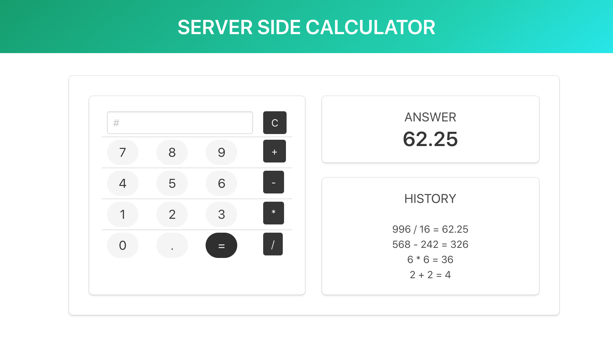

# jQuery Server Side Calculator

A simple server-side calculator using jQuery. 

All operations — addition, subtraction, multiplication, division — are functionally possible. Past calculations are recorded in the *History* section. 

For this weekend project, I tested out styling with Bulma CSS library.

---

---

## Installation & Startup

- Requires: [Node.js](https://nodejs.org/en/)

To install: ```npm install```

For startup, simply: ```npm start```
